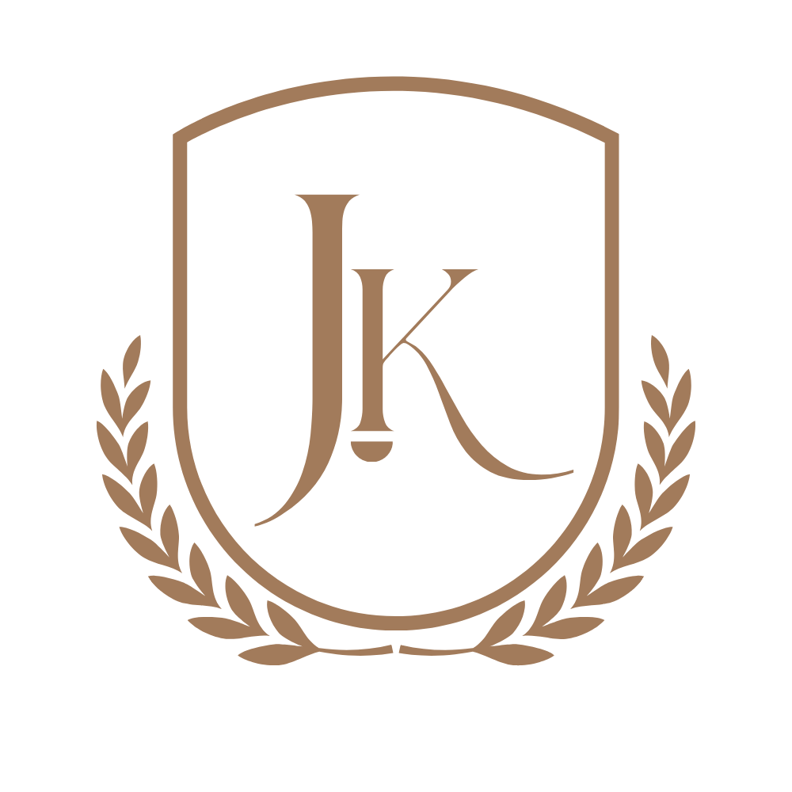

# DESIGN.md — JK Jurídico

Referência completa de identidade visual. Aplicada em `index.html`, `membros.html`, `checklist-antiplagio.html` e demais páginas do projeto.

---

## Personalidade da marca

**Acadêmica · Autoral · Moderna**

Julia é pesquisadora publicada em periódico Qualis indexado — não prestadora de serviço genérica. Voz: precisa, sem jargão desnecessário, com autoridade discreta. Objetivo emocional: confiança técnica + calor humano.

Anti-referência: sites genéricos de freelancer jurídico, gradientes excessivos, templates de agência, interfaces SaaS genéricas, glassmorphism decorativo.

---

## Princípios de design

1. **Hierarquia antes de decoração** — cada elemento tem papel único; nada ornamental sem função.
2. **O botão verde é sagrado** — único elemento quente saturado em toda a LP; tudo ao redor recua. Usar apenas para CTA principal de captura. Na área de membros, o creme/dourado é o primário.
3. **Autoridade pelo conteúdo** — credibilidade vem da publicação Qualis, depoimentos e copy direto; o design apoia sem competir.
4. **Respira** — mais espaço em branco, menos elementos por viewport. Padding generoso.
5. **Autoral** — identidade de Julia aparece em cada página (monograma PNG, Spectral, voz precisa). Nunca substituir o monograma por texto puro.

---

## Tipografia

| Fonte | Papel | Pesos |
|---|---|---|
| **Spectral** (serif) | Display — h1, h2, títulos de seção, preços, badges, aspas decorativas | 300, 400, 600 (normal e itálico) |
| **Jost** (sans) | Body — corpo de texto, labels, botões, nav, formulários, tags | 300, 400, 500, 600, 700 |

**Google Fonts (URL completa):**
```
https://fonts.googleapis.com/css2?family=Spectral:ital,wght@0,300;0,400;0,600;1,300;1,400;1,600&family=Jost:wght@300;400;500;600;700&display=swap
```

**Fontes removidas (não usar):** Aboreto, Gotu, Figtree.

---

## Paletas de cor

### Modo Claro — "Editorial Claro" (padrão)

```css
:root {
  --bg:           #F7F3EC;               /* fundo principal — marfim */
  --surface:      #EDE8DE;               /* cards, seções alternadas */
  --card:         #FDFAF5;               /* cards em membros/painel */
  --card-hover:   #EDE8DE;
  --nav:          #2A2118;               /* nav/sidebar — SEMPRE escuro, ignora o tema */
  --text:         #2A2118;               /* títulos, peso máximo */
  --text-body:    rgba(42,33,24,0.82);   /* corpo de texto */
  --text-meta:    rgba(42,33,24,0.70);   /* labels, metas, notas */
  --text-faint:   rgba(42,33,24,0.52);   /* placeholders, roles decorativos */
  --creme:        #A27B5B;               /* accent dourado/terra — primário na área de membros */
  --creme-soft:   rgba(162,123,91,0.12);
  --creme-border: rgba(162,123,91,0.30);
  --verde:        #27AE60;               /* CTA — único elemento saturado, SAGRADO */
  --verde-dark:   #219A52;
  --vermelho:     #E74C3C;               /* pain points */
  --border:       rgba(42,33,24,0.09);
  --border-m:     rgba(42,33,24,0.13);
  --hover-bg:     rgba(42,33,24,0.04);
}
```

### Modo Escuro — "Inkwell Quente" (toggle)

Paleta de marrons escuros quentes, mesma família do creme. **Não usar teal/verde** — a paleta original Inkwell (#2C3639, #3F4E4F) foi descartada.

```css
[data-theme="dark"] {
  --bg:           #1A1510;               /* marrom muito escuro */
  --surface:      #221C14;               /* superfície ligeiramente mais clara */
  --card:         #2A2118;               /* mesmo valor do --nav no claro */
  --card-hover:   #2F2419;
  --nav:          #2A2118;               /* sidebar sempre escuro */
  --text:         #DCD7C9;               /* au-lait */
  --text-body:    rgba(220,215,201,0.82);
  --text-meta:    rgba(220,215,201,0.65);
  --text-faint:   rgba(220,215,201,0.45);
  --creme:        #A27B5B;               /* mantém igual */
  --creme-soft:   rgba(162,123,91,0.14);
  --creme-border: rgba(162,123,91,0.25);
  --verde:        #27AE60;               /* mantém igual */
  --verde-dark:   #219A52;
  --vermelho:     #E74C3C;
  --border:       rgba(162,123,91,0.09);
  --border-m:     rgba(162,123,91,0.14);
  --hover-bg:     rgba(162,123,91,0.06);
}
```

**Regra do tema:** Nav/sidebar sempre `#2A2118` independente do tema. Toggle salvo em `localStorage("jk-theme")`. Anti-FOUC: script inline no `<head>` antes do React carregar.

---

## Hierarquia de contraste

| Uso | Variável | Opacidade |
|---|---|---|
| Títulos, peso máximo | `--text` | 100% |
| Corpo de texto | `--text-body` | 82% |
| Labels, metas, notas | `--text-meta` | 70% |
| Placeholder, decorativo | `--text-faint` | 52% |

**Regra:** texto funcional (que o usuário precisa ler) usa no mínimo `--text-meta`. `--text-faint` apenas para placeholders e elementos puramente decorativos. Em fundo claro, opacidades abaixo de 52% ficam ilegíveis.

---

## Padrão de fundo hero / login

O mesmo padrão é usado no hero da LP e na tela de login da área de membros.

```css
/* Camada 1 — radial gradient creme */
background: radial-gradient(ellipse 80% 60% at 50% 20%, rgba(162,123,91,0.09) 0%, transparent 70%);

/* Camada 2 — grid de linhas finas */
background-image:
  linear-gradient(rgba(162,123,91,0.04) 1px, transparent 1px),
  linear-gradient(90deg, rgba(162,123,91,0.04) 1px, transparent 1px);
background-size: 80px 80px;

/* Camada 3 — máscara para centralizar o efeito */
mask-image: radial-gradient(ellipse 85% 70% at 50% 40%, black 30%, transparent 100%);
-webkit-mask-image: radial-gradient(ellipse 85% 70% at 50% 40%, black 30%, transparent 100%);
```

---

## Animações

### Entrada (heroFade / loginFade)
```css
@keyframes heroFade {
  from { opacity: 0; transform: translateY(22px); }
  to   { opacity: 1; transform: none; }
}
/* Delays escalonados — logo: 0.1s, card/portrait: 0.35s, footer: 0.45s */
.hero-left     { animation: heroFade 0.85s cubic-bezier(0.4,0,0.2,1) 0.15s both; }
.hero-portrait { animation: heroFade 0.85s cubic-bezier(0.4,0,0.2,1) 0.38s both; }
```

### Scroll reveal (IntersectionObserver)
```css
.reveal { opacity: 0; transform: translateY(30px);
  transition: opacity 0.7s cubic-bezier(0.4,0,0.2,1), transform 0.7s cubic-bezier(0.4,0,0.2,1); }
.reveal.visible { opacity: 1; transform: none; }
.rv-d1 { transition-delay: 0.12s; }
.rv-d2 { transition-delay: 0.24s; }
.rv-d3 { transition-delay: 0.36s; }
.rv-d4 { transition-delay: 0.48s; }
```
```javascript
const revealObserver = new IntersectionObserver(entries => {
  entries.forEach(e => {
    if (e.isIntersecting) { e.target.classList.add('visible'); revealObserver.unobserve(e.target); }
  });
}, { threshold: 0.1, rootMargin: '0px 0px -40px 0px' });
document.querySelectorAll('.reveal').forEach(el => revealObserver.observe(el));
```

**Proibido:** bounce, elastic, animações em propriedades de layout (width, height, top, left). Usar ease-out com curva exponencial.

---

## Componentes

### Hierarquia de seção (label + título + divisor)
```html
<div class="section-label">LABEL EM CREME</div>
<h2 class="section-title">Título em Spectral</h2>
<div class="section-divider"></div>
```
```css
.section-label {
  font-family: 'Jost', sans-serif;
  font-size: 0.62rem; font-weight: 600;
  letter-spacing: 0.22em; text-transform: uppercase;
  color: var(--creme); margin-bottom: 0.75rem;
}
.section-title {
  font-family: 'Spectral', serif;
  font-size: clamp(1.9rem, 4vw, 2.8rem);
  font-weight: 400; color: var(--text);
  line-height: 1.18; letter-spacing: 0.01em;
}
.section-divider {
  display: block; width: 36px; height: 1.5px;
  background: var(--creme); opacity: 0.55;
  margin: 1rem 0 2.5rem; border-radius: 1px;
}
```

### Botão primário — creme (área de membros)
```css
.btn-primary {
  background: var(--creme); color: #fff;
  padding: 0.95rem 2.4rem;
  font-family: 'Jost', sans-serif; font-size: 0.78rem;
  font-weight: 700; letter-spacing: 0.12em; text-transform: uppercase;
  border-radius: 2px; transition: background 0.2s, transform 0.15s;
}
.btn-primary:hover { background: #8a6649; transform: translateY(-2px); }
```

### Botão CTA — verde (sagrado, apenas LP/captura)
```css
background: #27AE60; /* var(--verde) */
/* hover: */ background: #219A52;
```

### Cards de conteúdo
```css
background: var(--surface); border: 1px solid var(--border);
border-radius: 3px; padding: 2.2rem;
transition: border-color 0.25s, box-shadow 0.25s;
/* hover: */
border-color: var(--creme-border);
box-shadow: 0 4px 24px rgba(42,33,24,0.08);
```

### Nav / Sidebar (sempre escuro)
```css
/* LP nav */
nav { background: #2A2118; border-bottom: 1px solid rgba(162,123,91,0.25); }

/* Membros sidebar */
aside { background: #2A2118; border-right: 1px solid rgba(162,123,91,0.22); }
```

### Logo no nav
```html

<span style="font-family:'Spectral',serif; font-size:15px; color:#A27B5B; letter-spacing:0.04em;">JK Jurídico</span>
```

### Thumbnails de produto (área de membros)
Sempre fundo escuro com grid e accent creme — independente do tema global.
```jsx
const thumbMap = {
  "visual-law": { bg: "#1D1810", ac: "#A27B5B", lbl: "VISUAL LAW" },
  peticoes:     { bg: "#1A1410", ac: "#C4956A", lbl: "PETIÇÕES" },
  abnt:         { bg: "#161210", ac: "#A27B5B", lbl: "ABNT" },
  consultoria:  { bg: "#1E1912", ac: "#BF9068", lbl: "CONSULTORIA" },
  diagnostico:  { bg: "#19140E", ac: "#A27B5B", lbl: "DIAGNÓSTICO" },
};
/* title text: color: "rgba(220,215,201,0.90)" — sempre au-lait, nunca var(--text) */
```

### Aspas decorativas (depoimentos)
```css
.depo-quote {
  font-family: 'Spectral', serif; font-size: 6.5rem;
  font-weight: 600; font-style: italic;
  color: var(--creme); opacity: 0.13;
  line-height: 0.65; margin-bottom: -0.8rem;
  display: block; user-select: none;
}
```

### Hero assimétrico (LP)
```css
.hero-inner {
  display: grid; grid-template-columns: 1fr 300px;
  gap: 5rem; align-items: center;
}
.hero-portrait {
  aspect-ratio: 3/4; border-radius: 3px;
  box-shadow: 0 24px 64px rgba(42,33,24,0.16);
  border: 1px solid rgba(162,123,91,0.30);
}
```

---

## Breakpoints mobile

| Breakpoint | Mudanças |
|---|---|
| ≤ 960px | Membros: coluna única, sidebar some |
| ≤ 900px | Hero LP: coluna única, foto some; grids de preços/stats viram coluna única |
| ≤ 760px | Dores e depoimentos: coluna única |
| ≤ 620px | Nav: hambúrguer aparece, nav-center vira dropdown; padding reduzido |

Hambúrguer: toggle da classe `nav.open` que expande `.nav-center` como dropdown absoluto. Fecha ao clicar em qualquer link.

---

## Assets

| Arquivo | Uso | Observação |
|---|---|---|
| `monograma_jk.png` | Nav, sidebar, login, favicon | Brasão (escudo com JK + ramos de louro), linework dourado `#A27B5B`, fundo transparente. Vetor: `claude-design-social/logo-dourado.svg`. NUNCA substituir por texto puro. |
| `julia.png` | Hero LP, seção Sobre | Blazer branco, fundo claro. Principal ativo de confiança. |

---

## Regras absolutas (não negociáveis)

- `border-left` colorido como accent em cards: **proibido**. Usar fundo, borda completa ou nada.
- `background-clip: text` com gradiente: **proibido**. Usar cor sólida.
- Glassmorphism decorativo: **proibido**.
- Grid de cards idênticos (icon + heading + text repetido): **proibido**.
- Modal como primeira solução: esgotar alternativas inline antes.
- Botão verde fora de CTA de captura principal: **proibido**.
- Monograma substituído por texto: **proibido**.
